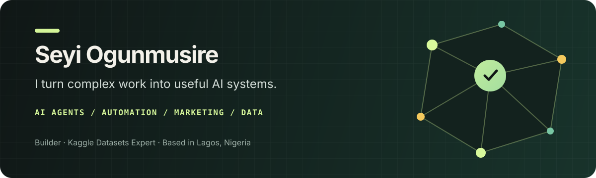

  

   
  
  
  

## Hello — I’m Seyi 👋🏾

I build practical systems that help people **find opportunities, work faster, sell more, and make better decisions**.

I’m a founder, product builder, and AI engineer working across artificial intelligence, business automation, marketing, and data science. My long-term focus is closing the gap between talent and opportunity—while helping useful businesses grow. I can move from understanding a real-world problem to designing the workflow, building the product, taking it to market, and measuring whether it actually works.

> I care less about technology that merely looks impressive and more about technology that makes someone’s day meaningfully easier.

### A few things I’m proud of

| | |
|---|---|
| **MantaJobs in production** | Grew an AI-assisted career platform to 100+ active users and 20,000+ live job listings. |
| **1st-place agent builder** | Won Nosana’s 2025 Agent 101 Challenge with MastraBolt, a no-code AI-agent platform. |
| **₦500M fraud uncovered** | Helped an Ondo State audit team identify payroll fraud through data analysis. |
| **Kaggle Datasets Expert** | Recognised for publishing useful datasets for the global data community. |
| **Top 2% on Zindi** | Ranked among leading African data scientists on the competition platform. |

## What I help people do

### 🤖 Build AI agents that handle real work

I design AI-powered tools that can understand requests, use the right information, and complete multi-step tasks. That includes conversational products, coding assistants, intelligent document workflows, and the APIs behind them.

### ⚙️ Automate repetitive business processes

I turn manual, error-prone routines into dependable workflows—connecting data, decisions, and software so teams can spend more time on the work that needs human judgment.

### 📣 Turn good offers into clearer marketing

Through [Copiwrite](https://www.copiwrite.com), I help Nigerian businesses explain what they sell, reach the right people, and turn attention into enquiries and orders across websites, ads, social media, email, and WhatsApp.

### 📊 Find the story—and the risk—inside data

I use data science, analytics, and visualisation to reveal patterns people can act on, from fraud detection and financial risk to business reporting and machine-learning problems.

## Products I’ve built

### [MantaJobs](https://www.mantajobs.com) — a clearer path from job search to application

As Founder and Product Lead, I built MantaJobs for African professionals who are overwhelmed by scattered job boards and generic recommendations. It brings relevant opportunities into one place, explains why each role fits, helps users decide with a swipe-based workflow, and keeps every application organised through interview or offer. The platform has grown to **100+ active users** and **20,000+ live listings**.

Behind that simple experience is a complete product system: scheduled job collection from job boards and company career pages, stale-listing checks, AI-assisted matching, application routing, carefully limited form automation, subscription access, a job tracker, personalised email journeys, and a jobs API published through RapidAPI.

MantaJobs also includes an AI résumé builder that can turn a LinkedIn profile into a professional résumé from a link.

`Product strategy` · `AI matching` · `Data pipelines` · `Automation` · `Payments` · `Lifecycle marketing` · `Cloud deployment`

### [Copiwrite](https://www.copiwrite.com) — clearer marketing, stronger sales

I founded Copiwrite and grew it to **250+ users** by combining product development with positioning, outreach, and acquisition. Today, it helps Nigerian business owners clarify their offers, create stronger sales pages and campaigns, improve buyer follow-up, and measure what brings results. I have also launched a WhatsApp sales training product, run Facebook campaigns, studied visitor behaviour with Microsoft Clarity, and conducted outbound campaigns for AI automation services.

`Positioning` · `Sales pages` · `Paid campaigns` · `Cold outreach` · `WhatsApp` · `Growth systems`

## AI agents & automation projects

### [MastraBolt](https://nosana.com/blog/agent-101-recap-how-builders-took-on-the-nosana-challenge/) — 1st place, Nosana Agent 101 Challenge

I built a visual development platform that lets people create, test, preview, and deploy AI agents from a browser without writing code. It supports multiple AI model providers and one-click deployment to Nosana, Vercel, or Netlify.

`No-code AI` · `Agent infrastructure` · `Multi-model support` · `Browser IDE` · `Nosana deployment`

### [ElizaReels / OpenReels](https://github.com/Theideabased/agent-challenge) — one prompt to a finished video

Built for the Nosana × ElizaOS Agent Challenge, this project turns a topic into a narrated short-form video. The ElizaOS agent interprets the request, writes a script, creates speech, finds suitable media, generates subtitles, and coordinates GPU rendering into a downloadable video.

`ElizaOS` · `Agent orchestration` · `AI video` · `Decentralised GPU` · `Next.js` · `FastAPI`

### [ASI-Sopilot](https://github.com/Theideabased/ASI-Sopilot) — collaborative AI agents for Solana

I created a multi-agent system that makes complex DeFi research easier to explore through conversation. A coordinator works with specialist agents for token analysis and market intelligence, then combines their findings into one understandable response.

[View the live interface](https://solpilot-ai.vercel.app/) · `Fetch.ai uAgents` · `Multi-agent systems` · `Solana` · `Market research`

### [Business Email Data API](https://github.com/Theideabased/verified_email_list) — responsible data collection at production scale

I built a scheduled pipeline that discovers company websites, extracts public business contact information, applies validation and suppression rules, and serves permitted records through an API. It runs on Google Cloud with automated collection, PostgreSQL storage, recovery controls, tests, and a RapidAPI-ready interface.

`Data engineering` · `Web automation` · `FastAPI` · `PostgreSQL` · `Cloud Run` · `Responsible data controls`

### [Yoruba Talking Drum AI](https://github.com/Theideabased/yomi_talking_drum) — cultural preservation through machine learning

I developed the software and deployment workflow for a research project that classifies Yoruba talking-drum audio into tonic-solfa notes. The system combines audio feature engineering, a PyTorch model, an API, and an accessible web interface for uploading recordings and viewing predictions.

`Audio AI` · `PyTorch` · `Cultural technology` · `React` · `FastAPI` · `Model deployment`

## Experience & public impact

### [Elastic AI](https://elasticapp.ai/) — an AI coding partner inside VS Code · 2025–2026

As a founding-team Software Engineer, I helped build an autonomous coding agent, developed the chat API that connects users with AI models, and contributed to authentication infrastructure.

`AI agents` · `Conversational APIs` · `Model integration` · `Authentication` · `Payments`

### Ondo State payroll audit — data that protected public funds

I worked with the state audit team to analyse its salary system and uncover approximately **₦500 million in fraud**. I then built an Excel/VBA detection workflow to help identify similar issues more efficiently.

`Fraud detection` · `Data analysis` · `Excel automation` · `Public-sector impact`

### AI & Robotics Lab, University of Lagos — helping young people build

I taught Python, robotics, and practical problem-solving to children and teenagers. Around 80% of learners successfully programmed instructions and models for drones and robotics hardware, and a team I mentored won a national innovation award.

`Teaching` · `Python` · `Robotics` · `Mentorship`

## My working toolkit

| Capability | Tools and experience |
|---|---|
| **AI & intelligent products** | Generative AI, AI agents, multi-agent systems, LLM workflows, recommendation systems, audio AI |
| **Software & integrations** | Python, JavaScript, React, Next.js, FastAPI, APIs, authentication, payments |
| **Automation & cloud** | Data collection, scheduled workflows, Docker, Google Cloud Run, Vercel, Supabase, PostgreSQL |
| **Data & decision-making** | SQL, R, Power BI, Excel, VBA, machine learning, analytics |
| **Growth & communication** | Positioning, lead research, cold email, sales copy, Facebook ads, lifecycle email, Microsoft Clarity, customer journeys |
| **Business automation** | Make.com, Twilio, marketing workflows, application automation, scheduled cloud jobs |

The tools matter, but the outcome matters more. I choose technology based on the problem, the people using it, and what success should look like.

## Recognition & learning

- **Kaggle Datasets Expert** — [view my Kaggle work](https://www.kaggle.com/ogunmusireseyi/)
- **Top 2% Data Scientist on Zindi** — [view my Zindi profile](https://zindi.africa/users/Man_of_God)
- **1st Place**, [Nosana Agent 101 Challenge](https://nosana.com/blog/agent-101-recap-how-builders-took-on-the-nosana-challenge/) with MastraBolt (2025)
- **Winner**, Data Science Africa Health Mobility Geospatial Competition (2022)
- **AI Agents Fundamentals**, Hugging Face — [view certificate](https://huggingface.co/datasets/agents-course/certificates/resolve/main/certificates/seyman/2025-03-04.png)
- **Introduction to LangGraph**, LangChain Academy — [view certificate](https://academy.langchain.com/certificates/j4tclcrae1)
- **BSc Actuarial Science**, University of Lagos — GPA 4.42/5.00 · NYSC completed

## How I approach a project

1. **Understand the real problem** — who is affected, what is slow or unclear, and what success means.
2. **Design the simplest useful system** — map the journey before choosing the technology.
3. **Build and connect the workflow** — combine software, AI, automation, and communication where they add value.
4. **Measure what changed** — use evidence to improve the system instead of relying on assumptions.

## Let’s build something useful

If you are exploring an AI product, want to automate a business process, need clearer marketing, or have data that should be working harder for you, I’d be glad to talk.

**[Explore MantaJobs](https://www.mantajobs.com)** · **[Connect on LinkedIn](https://www.linkedin.com/in/ogunmusire-seyi)** · **[See Copiwrite](https://www.copiwrite.com)** · **[View my Kaggle profile](https://www.kaggle.com/ogunmusireseyi/)**

  Built from Lagos, Nigeria 🇳🇬 — with curiosity, evidence, and care.

